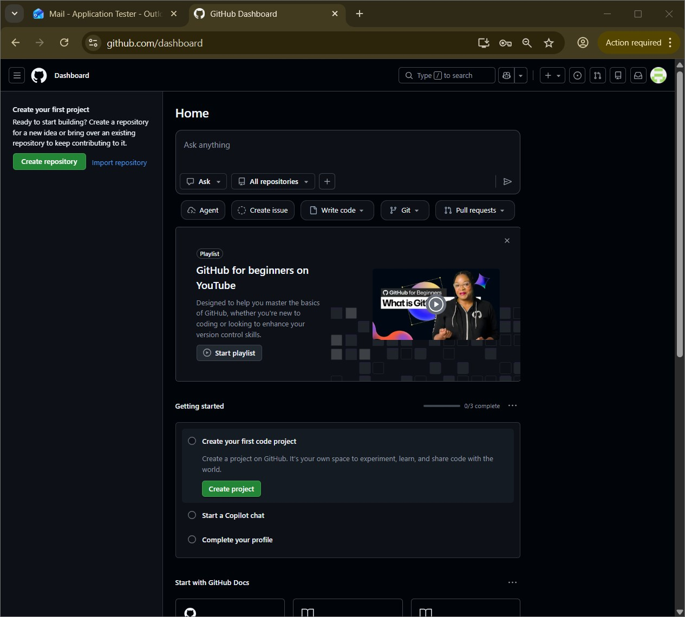
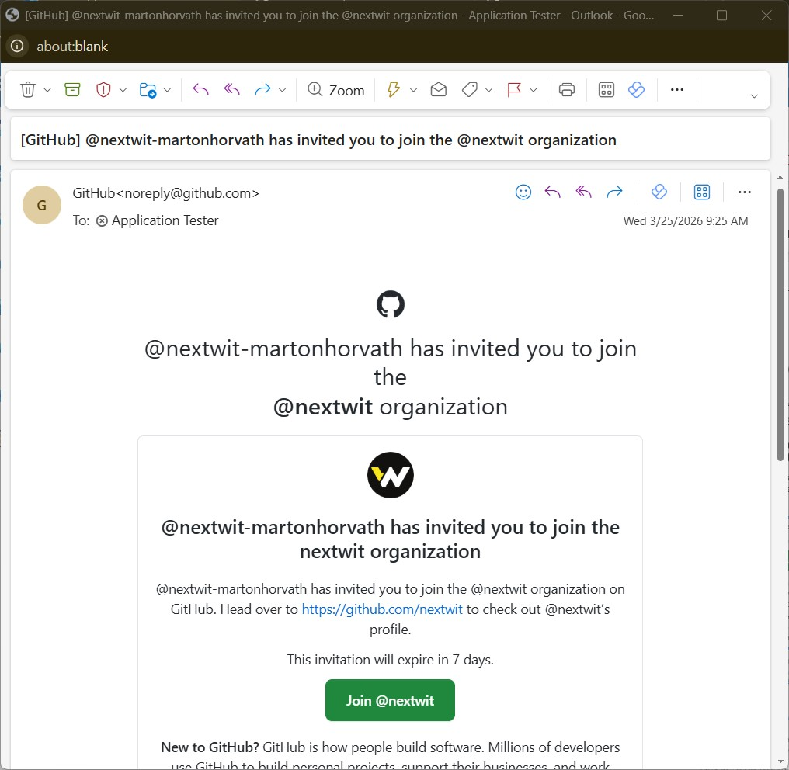

# What is GitHub

GitHub is a web-based platform for version control and collaboration that uses Git. It allows us to host, review, and collaborate on artifacts relate to our projects.

### Key terms:

**Organization:** A group account on GitHub for a company or team. It helps people work together and manage shared repositories.

**Repository:** A folder on GitHub where files, code, and version history are stored.

**Commit:** A saved change in a repository. Each commit has a message that explains what was changed.

**Local:** Your copy on your own computer, where you make changes before sharing them.

**Origin / Remote:** The online version of your repository (usually on GitHub). `origin` is the default name Git uses for that remote location.

**Fetch:** Download updates from the remote repository WITHOUT changing your local files.

**Pull:** Download updates from the remote repository AND merge them into your local copy.

**Push:** Upload your local commits to the remote repository so others can see your changes.

# Login to github

1. Create personal account

2. First login

3. Accept Nextwit invite

4. Create your first private repository

https://github.com/nextwit/template-personal-files